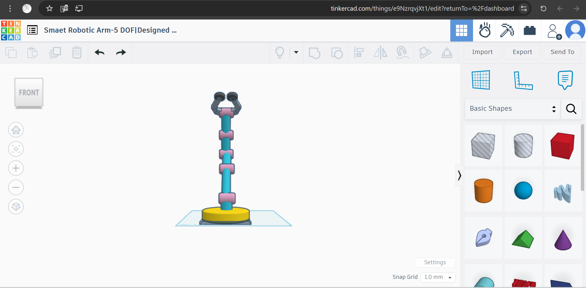
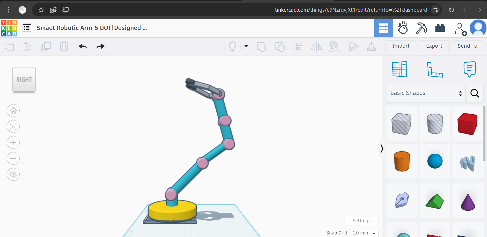
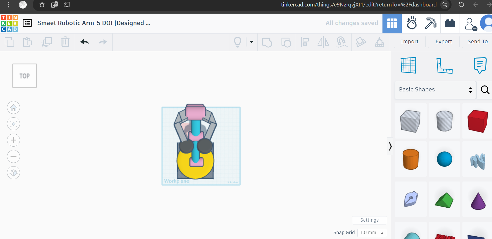
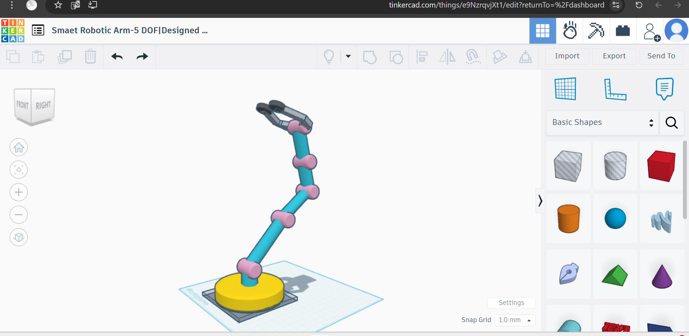

# 🤖 Smart Robotic Arm – 5 Degrees of Freedom  
*Designed by: Abeer Alasmri*  
*Platform:* Tinkercad  
*Specialization:* Mechanical Engineering  
*Program:* Smart Methods – Summer Training 2025

---

## 📌 Project Idea

This project is a 3D design of a robotic arm using Tinkercad.  
It features *5 Degrees of Freedom (DOF)* and simulates the motion and structure of real industrial robotic arms used in automation and manufacturing.

---

## 🎯 Project Goals

- Practice 3D design using Tinkercad  
- Understand robotic arm components and structure  
- Simulate the motion using joints and links  
- Develop alignment and modeling accuracy

---

## 🧩 Design Components

| Part              | Quantity | Description                      |
|-------------------|----------|----------------------------------|
| Base Cylinder     | 1        | Rotating base of the arm         |
| Joint Cylinders   | 5        | Rotational joints between links  |
| Arm Links         | 5        | Connects joints together         |
| Gripper (Claw)    | 1        | End effector to grip objects     |

Used tools in Tinkercad:
- *Align Tool* for centering parts  
- *Rotate & Move Tools* for orientation  
- *Group/Ungroup* for combining shapes

---

## 🖼 Design Screenshots

| View       | Screenshot                  |
|------------|-----------------------------|
| Front      |   
| Right      |   
| Top        |   
| Isometric  | 

---

## 🔗 Tinkercad Project Link

👉 [Click here to view the design on Tinkercad](https://www.tinkercad.com/things/e9NzrqvjXt1)

---

## 💬 What I Learned

Through this project, I learned how to:
- Use Tinkercad for mechanical modeling  
- Understand robotic joints and structure  
- Improve my 3D design and spatial thinking  
- Organize and document technical work professionally

---

## 👩🏻‍💻 Designer:
*Abeer Alasmri – Summer Internship 2025*
